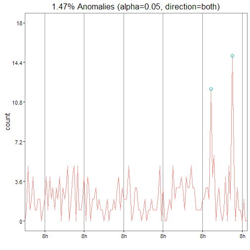

## Hazmat Anomaly Detection
#### Authors: Daniel Schweigert & Jude Calvillo
#### Team: Data Science Working Group @ Code for San Francisco

The following function detects anomalies, based on deviation from a time series' underlying seasonality and trends. We do this per state. We begin with a sample plot, for a given state, followed by our complete list of anomalies, across states.


```r
library(AnomalyDetection)

## Load data
dat <- read.csv("data/hazmat_year_month.csv")

## Get months and format to work for monthly basis
dat$Year.Month = paste(dat$Year.Month,'01',sep='-')
dat$Year.Month = as.POSIXct(strptime(dat$Year.Month, "%Y-%m-%d"))

## Create empty dataframe
res_df <- data.frame()

## Factorize state
dat$State <- as.factor(dat$State)

## Run each state's data through anomaly detection
for(i in 1:length(levels(dat$State))){
    res <- AnomalyDetectionTs(dat[dat$State %in% levels(dat$State)[i],c("Year.Month","Report.Number")], max_anoms=0.05, 
                              direction='both', plot=T)
    per_state <- res$anom
    per_state$state <- rep(levels(dat$State)[i], nrow(per_state))
    res_df <- rbind(res_df, per_state)
}
```


```r
print(res$plot)
```



Below, we show those dates for which the incident count is anomolous to each state's seasonality and trend, if any.


```
##    state  timestamp incidents
## 1     AL 2006-05-01        36
## 2     AL 2013-11-01        38
## 3     CA 2005-01-01         0
## 4     CA 2016-03-01         1
## 5     CA 2016-04-01         0
## 6     CO 2016-04-01         0
## 7     CT 2016-04-01         0
## 8     DC 2005-11-01         2
## 9     DC 2005-12-01         2
## 10    DC 2006-02-01         2
## 11    DC 2006-04-01         3
## 12    DC 2007-06-01         2
## 13    DC 2008-12-01         3
## 14    DE 2007-08-01         7
## 15    FL 2005-01-01         0
## 16    FL 2011-08-01        92
## 17    FL 2016-02-01        17
## 18    FL 2016-03-01         1
## 19    FL 2016-04-01         0
## 20    GU 2005-02-01         2
## 21    GU 2005-12-01         5
## 22    GU 2007-07-01         1
## 23    GU 2007-09-01         1
## 24    GU 2009-09-01         1
## 25    GU 2011-08-01         1
## 26    HI 2008-11-01         5
## 27    HI 2010-04-01         6
## 28    ID 2006-06-01        16
## 29    IL 2005-01-01         0
## 30    IL 2016-03-01         1
## 31    IL 2016-04-01         0
## 32    KY 2005-01-01         0
## 33    LA 2010-06-01        48
## 34    LA 2013-10-01        46
## 35    LA 2014-05-01        43
## 36    ME 2006-10-01         9
## 37    ME 2009-07-01         9
## 38    MN 2006-05-01        50
## 39    MN 2006-06-01        54
## 40    MS 2015-07-01        28
## 41    MT 2007-07-01        15
## 42    MT 2012-08-01        16
## 43    MT 2015-07-01        14
## 44    NC 2005-01-01         0
## 45    NC 2016-04-01         0
## 46    ND 2013-12-01        21
## 47    ND 2015-05-01        13
## 48    NJ 2005-01-01         0
## 49    NV 2006-05-01        26
## 50    NY 2005-01-01         0
## 51    NY 2007-05-01        71
## 52    NY 2010-02-01        68
## 53    NY 2016-03-01         1
## 54    NY 2016-04-01         0
## 55    OH 2006-06-01       504
## 56    OH 2006-08-01       309
## 57    OH 2006-09-01       464
## 58    OH 2006-10-01       345
## 59    PR 2008-05-01         5
## 60    PR 2008-08-01         5
## 61    PR 2010-03-01         5
## 62    RI 2007-09-01        17
## 63    RI 2007-11-01        11
## 64    SD 2007-08-01        10
## 65    TN 2005-01-01         0
## 66    TN 2016-03-01         0
## 67    TN 2016-04-01         0
## 68    TX 2005-01-01         0
## 69    TX 2014-08-01       232
## 70    TX 2016-03-01         1
## 71    TX 2016-04-01         0
## 72    VA 2009-04-01        44
## 73    VI 2007-11-01         1
## 74    VI 2011-01-01         1
## 75    VI 2012-03-01         1
## 76    VI 2012-10-01         1
## 77    VI 2013-06-01         1
## 78    VI 2015-11-01         1
## 79    WA 2007-10-01        48
## 80    WI 2005-01-01         0
## 81    WI 2016-03-01         0
## 82    WI 2016-04-01         0
## 83    WV 2007-02-01        16
## 84    WV 2011-06-01        13
## 85    WV 2013-12-01        22
## 86    WV 2014-07-01        12
## 87    WV 2015-02-01        26
## 88    WY 2014-06-01        12
## 89    WY 2015-07-01        15
```

Note that the `echo = FALSE` parameter was added to the code chunk to prevent printing of the R code that generated the plot.
