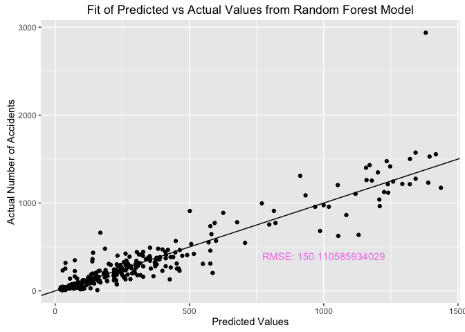

#### Load Data with Merge Hazmat Incidents with Oil, Gas, and Employment Statistics

``` r
    all_data <- read.csv("../Bayes_Hack/employment_gas_oil_data_merge.csv") %>% rename(year = Year)
    # Get rid of territories since they are missing data
    territories <- c("Guam", "Puerto Rico", "Virgin Islands", "Dist. of Columbia" )
    all_data_mod <- all_data %>% filter(!(State %in% territories), year!=2016 )
```

#### Prototype Machine Learning Models with Caret:

Create test and training sets:

``` r
set.seed(5678)
all_data_clean <- all_data_mod %>% select(-year, -State)
    ind <- sample(2, nrow(all_data_clean), replace = TRUE, prob = c(.75, .25))
    training_set <- all_data_clean[ind ==1,] 
    test_set <- all_data_clean[ind ==2,] 

    #------------ For 5-fold cross validation for all models -----#
    train_control <- trainControl(method = "cv", number = 5)
    #--------------------------------------------------------------#
```

Fit Different Models to the training set:

``` r
# K-Nearest Neighbor Models    
knn_fit <- train(number_of_hazardous_incidents ~. , training_set, method = "knn", 
                       preProcess = c("center", "scale"), trControl = train_control,
                       tuneGrid = expand.grid(k = c(1,2,3,4,5,6)))

knn_fit_pca <- train(number_of_hazardous_incidents ~. , training_set, method = "knn", 
                           preProcess = c("scale", "pca"), trControl = train_control,
                           tuneGrid = expand.grid(k = c(1,2,3,4,5,6, 7, 8, 9, 10)))
random_knn <- train(number_of_hazardous_incidents ~. , training_set, method = "rknn", 
                          preProcess = c("center", "scale"), trControl = train_control,
                          tuneGrid = expand.grid(k = c(1,2,3,4,5,6,7,8,9),mtry = c(1)))

forest_fit <- train(number_of_hazardous_incidents ~. , training_set, method = "rf", 
                          preProcess = c("center", "scale"), trControl = train_control,
                          tuneGrid = expand.grid(mtry = c(6,7,8,9,10)))

knn_fit 
```

    ## k-Nearest Neighbors 
    ## 
    ## 931 samples
    ##  10 predictor
    ## 
    ## Pre-processing: centered (10), scaled (10) 
    ## Resampling: Cross-Validated (5 fold) 
    ## Summary of sample sizes: 745, 744, 745, 744, 746 
    ## Resampling results across tuning parameters:
    ## 
    ##   k  RMSE      Rsquared   RMSE SD   Rsquared SD
    ##   1  180.0909  0.7230998  17.91429  0.08485836 
    ##   2  168.1543  0.7516241  25.21363  0.08862993 
    ##   3  161.8263  0.7710409  23.72254  0.06695925 
    ##   4  159.0821  0.7758711  21.47793  0.05848358 
    ##   5  162.2579  0.7673899  20.63987  0.05716895 
    ##   6  167.3964  0.7512009  22.30915  0.05705901 
    ## 
    ## RMSE was used to select the optimal model using  the smallest value.
    ## The final value used for the model was k = 4.

``` r
knn_fit_pca 
```

    ## k-Nearest Neighbors 
    ## 
    ## 931 samples
    ##  10 predictor
    ## 
    ## Pre-processing: scaled (10), principal component signal extraction
    ##  (10), centered (10) 
    ## Resampling: Cross-Validated (5 fold) 
    ## Summary of sample sizes: 744, 744, 745, 745, 746 
    ## Resampling results across tuning parameters:
    ## 
    ##   k   RMSE      Rsquared   RMSE SD   Rsquared SD
    ##    1  205.2646  0.6587502  58.10557  0.12572941 
    ##    2  203.6738  0.6528555  47.23468  0.10534820 
    ##    3  191.3533  0.6816428  48.11336  0.10915807 
    ##    4  199.0049  0.6574488  42.20056  0.09544775 
    ##    5  199.0726  0.6563534  39.47507  0.08927044 
    ##    6  199.1349  0.6557853  36.93876  0.08344354 
    ##    7  199.9109  0.6491515  35.49054  0.08404301 
    ##    8  201.7577  0.6398429  32.35847  0.07463556 
    ##    9  200.7679  0.6401739  32.08883  0.07542037 
    ##   10  200.1892  0.6404153  35.30635  0.08220309 
    ## 
    ## RMSE was used to select the optimal model using  the smallest value.
    ## The final value used for the model was k = 3.

``` r
random_knn  
```

    ## Random k-Nearest Neighbors 
    ## 
    ## 931 samples
    ##  10 predictor
    ## 
    ## Pre-processing: centered (10), scaled (10) 
    ## Resampling: Cross-Validated (5 fold) 
    ## Summary of sample sizes: 745, 744, 745, 744, 746 
    ## Resampling results across tuning parameters:
    ## 
    ##   k  RMSE      Rsquared  RMSE SD  
    ##   1  353.0473  NaN       16.419668
    ##   2  346.7706  NaN        8.631361
    ##   3  347.3136  NaN        6.924759
    ##   4  350.8994  NaN        5.892116
    ##   5  348.3185  NaN        8.088217
    ##   6  348.2139  NaN        8.827851
    ##   7  348.0658  NaN       12.790645
    ##   8  345.5595  NaN       12.418408
    ##   9  346.8270  NaN       11.467108
    ## 
    ## Tuning parameter 'mtry' was held constant at a value of 1
    ## RMSE was used to select the optimal model using  the smallest value.
    ## The final values used for the model were k = 8 and mtry = 1.

``` r
forest_fit
```

    ## Random Forest 
    ## 
    ## 931 samples
    ##  10 predictor
    ## 
    ## Pre-processing: centered (10), scaled (10) 
    ## Resampling: Cross-Validated (5 fold) 
    ## Summary of sample sizes: 746, 745, 744, 744, 745 
    ## Resampling results across tuning parameters:
    ## 
    ##   mtry  RMSE      Rsquared   RMSE SD   Rsquared SD
    ##    6    118.6501  0.8794121  14.21495  0.02300776 
    ##    7    117.5972  0.8811873  13.03770  0.01871440 
    ##    8    117.4733  0.8810074  13.16539  0.01951565 
    ##    9    118.0208  0.8796183  12.56639  0.02072011 
    ##   10    118.8101  0.8783684  13.02250  0.02040294 
    ## 
    ## RMSE was used to select the optimal model using  the smallest value.
    ## The final value used for the model was mtry = 8.

Comparison of Parameter selection on RSME for the different models:

``` r
library(gridExtra) 
grid.arrange(   plot(knn_fit),
                plot(knn_fit_pca),
                plot(random_knn),
                plot(forest_fit))
```


The Random Forest is the best performing model. Let's run the model on the test set:

``` r
forest_predict <- predict(forest_fit, newdata = test_set)
forest_RMSE <- RMSE(test_set$number_of_hazardous_incidents, forest_predict)
    qplot(forest_predict, test_set$number_of_hazardous_incidents,
          xlab = "Predicted Values", ylab = "Actual Number of Accidents",
          main = "Fit of Predicted vs Actual Values from Random Forest Model") + geom_abline() +
    annotate("text", x = 1000, y = 400, label = paste0("RMSE: ", forest_RMSE), col = "violet")
```



Measure of Feature Importance:

``` r
library(randomForest)
random_forest <- randomForest(number_of_hazardous_incidents ~.,data = training_set,
                              mtry = 10, importance = T)
importance(random_forest)
```

    FALSE                                  %IncMSE IncNodePurity
    FALSE employees_mining_logging_1000 102.048852    31929900.1
    FALSE num_acres_leased_yr             4.992997      405265.4
    FALSE num_acres_leased               52.420151    20732271.0
    FALSE num_leases_in_effect           20.779338     8814001.4
    FALSE num_new_leases_yr               3.485826      388586.5
    FALSE num_of_producible_wells        25.158260    10859190.9
    FALSE num_of_producible_completions  22.456119     9017303.7
    FALSE num_producing_acres            14.483919     3977846.9
    FALSE num_producing_leases           39.229052    15688411.1
    FALSE num_wells_spudded_yr            6.452014     1239744.3

Number of employee, number of acres leased for energy development, and number of leases for producing energy have the highes predictive value for predicting hazmat incidences.

#### Data visualization of top three Features:

``` r
important_features <- all_data_clean %>% select(employees_mining_logging_1000, num_acres_leased,num_producing_leases, number_of_hazardous_incidents)

rpartTune <- train(number_of_hazardous_incidents ~ ., 
                   data = important_features, method = "rpart",
                   trControl = train_control)

rpartTune
```

    FALSE CART 
    FALSE 
    FALSE 1212 samples
    FALSE    3 predictor
    FALSE 
    FALSE No pre-processing
    FALSE Resampling: Cross-Validated (5 fold) 
    FALSE Summary of sample sizes: 968, 969, 969, 971, 971 
    FALSE Resampling results across tuning parameters:
    FALSE 
    FALSE   cp          RMSE      Rsquared    RMSE SD   Rsquared SD
    FALSE   0.06764493  246.4161  0.49339471  32.49397  0.15585362 
    FALSE   0.10634129  312.0600  0.20206552  32.92707  0.08450907 
    FALSE   0.15244884  344.7182  0.07541223  37.53558  0.02263899 
    FALSE 
    FALSE RMSE was used to select the optimal model using  the smallest value.
    FALSE The final value used for the model was cp = 0.06764493.

Decision Tree Model:

``` r
library(rattle)
library(rpart.plot)
fancyRpartPlot(rpartTune$finalModel)
```


This CART tree illustrates the effect that the most important features have on Hazmat related incidences. States that have more mining and logging employees tend to have more incidents, as well as states with more acres and leases involved in oil and gas production.
