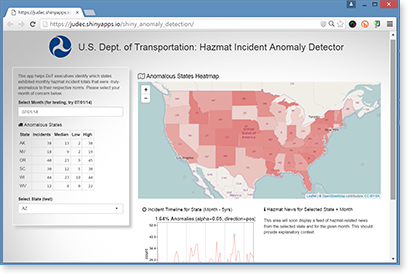

## [DoT Hazmat Incident Anomaly Detector (R + Shiny + Leaflet) >>](https://judec.shinyapps.io/shiny_anomaly_detection/)
by [Jude Calvillo](http://linkd.in/vVlpXA)  
[Data Science Working Group](http://datascience.codeforsanfrancisco.org)  
[Code for San Francisco](http://www.codeforsanfrancisco.org)  

This application helps DoT execs identify those states that exhibited an anomolous number of hazmat incidents in a given month, after accounting for each state's incident seasonality and trend. Thereafter, these execs can click one of the anomolous states (via the embedded map) to get more context from a time-series of incidents for that state (anomolous months highlighted), as well as hazmat-related news from that state during month.  

*Long-term goal: This project serves as a proof of concept for a generalized temporal-spatial anomaly detector to be used for a wide variety of government/civic-hacking purpose (i.e. parameters = time interval, geographical unit, target news topics).*  

  

***

### Status, as of Oct. 22, 2016:
v2.0 - Complete / Beta

* ALL DONE. :) - Hazmat-related news results integrated as HTML + javascript and map interactivity now bug-free.
* Next steps: 
    - Update dataset (current data only goes up to March, 2016) and work with Dan @ DoT to get some kind of live/daily data feed. 
    - Try to refine MS Cognitive Services API call for consistently more relevant news search results.
    - Try to create and employ a custom 'month picker' Shiny input object, as Shiny Apps does not offer a month picker widget or useful dateInput option. Some useful links...
        - jQuery Month Picker: http://jsfiddle.net/kidsysco/JeZap/
        - How to Build Custom Shiny Input Objects: http://shiny.rstudio.com/articles/building-inputs.html
    - Attempt to generalize this for MANY temporal-spatial civic anomaly detection purposes!!

#### SEO tags, because, well, why not? :)

Shiny, Shiny app, anomaly detection, Leaflet, department of transportation, data science working group, code for san francisco, R, r programming, jude calvillo
