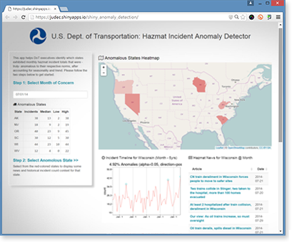

### [DoT Hazmat Incident Anomaly Detector (R + Shiny + Leaflet) >>](https://judec.shinyapps.io/shiny_anomaly_detection/)
by [Jude Calvillo](http://linkd.in/vVlpXA)  
[Data Science Working Group](http://datascience.codeforsanfrancisco.org)  
[Code for San Francisco](http://www.codeforsanfrancisco.org)  

This application aims to help DoT execs identify those states that exhibited an anomolous number of hazmat incidents, after accounting for incident seasonality and trend, for their selected month. Thereafter, these execs can click one of these anomolous states (via the embedded map) to get more context in the form of a time-series of incidents for that state (anomolous months highlighted), as well as hazmat-related news from the selected state and month.  

  

***

### Status, as of August 14, 2016:
v1.7 News feed API incorporated. News search query and formatting refinements remain.

* About 95% done now! 
* Map interactivity complete and per-state anomaly plotting complete.
* News feed API ([Microsoft Cognitive Services](https://www.microsoft.com/cognitive-services)) now incorporated. 
* Have to refine my use of advanced operators in news feed request URL.
* Have to refine formatting of news results for UI (MS's API offers HTML formatting). 
* I should probably embed the news into a scrolling widget.
* For the future: Since Shiny doesn't offer a month picker widget, if we want to make the month selection quicker and easier to understand, we'll have to use straight HTML/javascript. [This jQuery UI seems perfect for the job >>](https://kidsysco.github.io/jquery-ui-month-picker/)
    - For my own notes: Pay particular attention to the Month Format and Month Parsing options...
    - https://api.jqueryui.com/datepicker/#utility-formatDate (we want to extract the month in ISO format: $.datepicker.parseDate( "yy-mm-dd", "2007-01-26" );)

* Also for the future: Some U.S. territories, like Puerto Rico, are in the DoT's hazmat incident report records, but, of course, they're not within the contiguous United States. If Dan @ DoT confirms that they'd also like to see anomolous territories in this app, we'll need a different polygons dataset (i.e. not "state" from 'maps' library).  

#### SEO tags, because, well, why not? :)

Shiny, Shiny app, anomaly detection, Leaflet, department of transportation, data science working group, code for san francisco, R, r programming, jude calvillo
